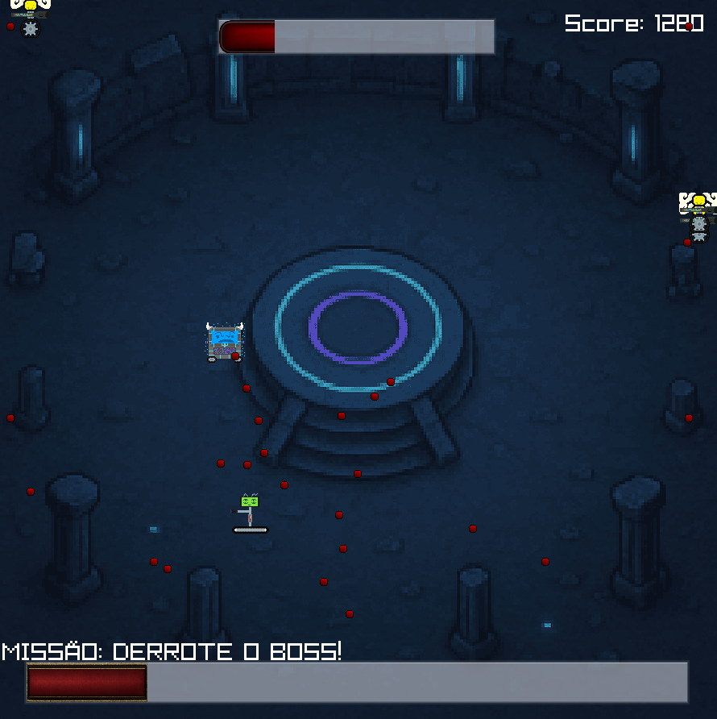

## Coliseu

### Description

Coliseu é um intenso jogo de arena no estilo "bullet hell" onde você controla um Robô Gladiador em um combate mortal pela sobrevivência. O desafio é dividido em duas fases eletrizantes: primeiro, sobreviva por dois minutos contra hordas de inimigos implacáveis em uma arena. Em seguida, se for forte o suficiente, entre no portal para enfrentar o temível Boss em uma batalha final épica. Use seus reflexos, atire sem parar e prove seu valor no Coliseu!

### Features

 - Sobrevivência Frenética: Enfrente ondas de inimigos com diferentes padrões de ataque e sobreviva por 2 minutos para provar seu valor.
 - Batalha de Chefe Épica: Após o tempo, um portal se abre para a sala do Boss. Derrote um chefe poderoso com múltiplos padrões de ataque que se intensificam conforme sua  vida diminui.
 - Movimentação e Disparos: Controle seu gladiador robótico com precisão e use disparos para eliminar os inimigos e o chefe final.

### Controls

Keyboard:
 - ARROW KEY UP: MOVER PARA CIMA
 - ARROW KEY DOWN: MOVER PARA BAIXO
 - ARROW KEY LEFT: MOVER PARA A ESQUERDA
 - ARROW KEY RIGHT: MOVER PARA DIREITA
Mouse:
 - BOTÃO ESQUERDO: Atirar

### Screenshots

### Developers

 - Titho Lívio - Estrura base do jogo (Struct personagens, movimentação do player, transição de fases (portal), Score), e os sprites (Player, Inimigos, Boss, e balas)
 - $(Developer 02) - $(Role/Tasks Developed)
 - $(Developer 03) - $(Role/Tasks Developed)

### License

This game sources are licensed under an unmodified zlib/libpng license, which is an OSI-certified, BSD-like license that allows static linking with closed source software. Check [LICENSE](LICENSE) for further details.

